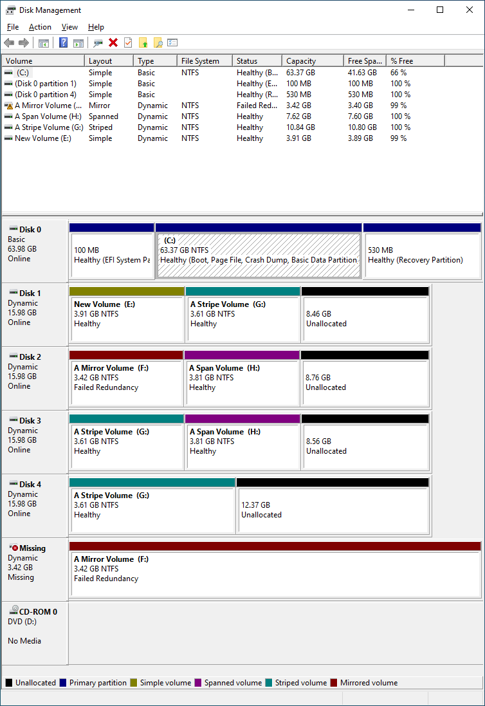

# windows_vds_exporter

**windows_vds_exporter** は [Virtual Disk Service (VDS)](https://learn.microsoft.com/en-us/windows/win32/vds/virtual-disk-service-portal) を使ってストレージの情報をエクスポートする Prometheus exporter です。ソフトウェア RAID のステータスを監視することを目的としています。

## 使い方

windows_vds_exporter 自身は Web サーバとして動作しません。その代わりに、以下のようにして使います。

- CGI プログラムとして使う。 CGI ホスト機能を持つ Web サーバと組み合わせます。
- textfile exporter として使う。[windows_exporter](https://github.com/prometheus-community/windows_exporter) の [textfile collector](https://github.com/prometheus-community/windows_exporter/blob/master/docs/collector.textfile.md) と組み合わせます。

どちらの場合でも SYSTEM 権限が必要です。

### CGI プログラムとして使う

`REQUEST_METHOD` 環境変数が設定されている場合は CGI プログラムとして動作します。

windows_vds_exporter が CGI プログラムとして実行されるよう、Web サーバ側で設定してください。

### textfile exporter として使う

`REQUEST_METHOD` 環境変数が設定されていない場合は textfile exporter として動作します。

タスクスケジューラなどで定期的に実行して、標準出力を windows_exporter が textfile を読むディレクトリに書き出してください。

## メトリクス

以下のメトリクスが開示されます。

| メトリクス名                        | 説明                                                             | ラベル                  | 値                                                   |
| ----------------------------------- | ---------------------------------------------------------------- | ----------------------- | ---------------------------------------------------- |
| windows_vds_volume_info             | ボリュームの基本情報                                             | name, type              | 1                                                    |
| windows_vds_volume_size_bytes       | ボリュームのサイズ                                               | name                    | ボリュームのサイズ（バイト単位）                     |
| windows_vds_volume_status           | ボリュームのステータス                                           | name, status            | 1                                                    |
| windows_vds_volume_transition_state | ボリュームの遷移状態                                             | name, transition_state  | 1                                                    |
| windows_vds_volume_health           | ボリュームの健全性                                               | name, health            | 1                                                    |
| windows_vds_volume_health_healthy   | ボリュームの健全性                                               | name                    | `health` が `Healthy` の時に 1。<br />それ以外は 0。 |
| windows_vds_volume_access_path      | ボリュームのアクセスパス（リパースポイントを経由したものを含む） | name, access_path       | 1                                                    |
| windows_vds_volume_reparse_point    | ボリュームのリパースポイント                                     | name, source_name, path | 1                                                    |

## 出力例

以下のような状況で、さらに "A Span Volume" は E:\mnt にもマウントされているとしましょう。



出力は以下のようになります。

```
# HELP windows_vds_volume_info Volume information
# TYPE windows_vds_volume_info gauge
windows_vds_volume_info{name="\\\\?\\GLOBALROOT\\Device\\CdRom0",type="Simple"} 1.000000
windows_vds_volume_info{name="\\\\?\\GLOBALROOT\\Device\\HarddiskVolume10",type="Simple"} 1.000000
windows_vds_volume_info{name="\\\\?\\GLOBALROOT\\Device\\HarddiskVolume11",type="Stripe"} 1.000000
windows_vds_volume_info{name="\\\\?\\GLOBALROOT\\Device\\HarddiskVolume12",type="Mirror"} 1.000000
windows_vds_volume_info{name="\\\\?\\GLOBALROOT\\Device\\HarddiskVolume3",type="Simple"} 1.000000
windows_vds_volume_info{name="\\\\?\\GLOBALROOT\\Device\\HarddiskVolume9",type="Span"} 1.000000

# HELP windows_vds_volume_size_bytes Volume size in bytes
# TYPE windows_vds_volume_size_bytes gauge
windows_vds_volume_size_bytes{name="\\\\?\\GLOBALROOT\\Device\\CdRom0"} 0.000000
windows_vds_volume_size_bytes{name="\\\\?\\GLOBALROOT\\Device\\HarddiskVolume10"} 4194304000.000000
windows_vds_volume_size_bytes{name="\\\\?\\GLOBALROOT\\Device\\HarddiskVolume11"} 11639193600.000000
windows_vds_volume_size_bytes{name="\\\\?\\GLOBALROOT\\Device\\HarddiskVolume12"} 3670016000.000000
windows_vds_volume_size_bytes{name="\\\\?\\GLOBALROOT\\Device\\HarddiskVolume3"} 68038467072.000000
windows_vds_volume_size_bytes{name="\\\\?\\GLOBALROOT\\Device\\HarddiskVolume9"} 8178892800.000000

# HELP windows_vds_volume_status Volume status
# TYPE windows_vds_volume_status gauge
windows_vds_volume_status{name="\\\\?\\GLOBALROOT\\Device\\CdRom0",status="NoMedia"} 1.000000
windows_vds_volume_status{name="\\\\?\\GLOBALROOT\\Device\\HarddiskVolume10",status="Online"} 1.000000
windows_vds_volume_status{name="\\\\?\\GLOBALROOT\\Device\\HarddiskVolume11",status="Online"} 1.000000
windows_vds_volume_status{name="\\\\?\\GLOBALROOT\\Device\\HarddiskVolume12",status="Online"} 1.000000
windows_vds_volume_status{name="\\\\?\\GLOBALROOT\\Device\\HarddiskVolume3",status="Online"} 1.000000
windows_vds_volume_status{name="\\\\?\\GLOBALROOT\\Device\\HarddiskVolume9",status="Online"} 1.000000

# HELP windows_vds_volume_transition_state Volume transition state
# TYPE windows_vds_volume_transition_state gauge
windows_vds_volume_transition_state{name="\\\\?\\GLOBALROOT\\Device\\CdRom0",transition_state="Stable"} 1.000000
windows_vds_volume_transition_state{name="\\\\?\\GLOBALROOT\\Device\\HarddiskVolume10",transition_state="Stable"} 1.000000
windows_vds_volume_transition_state{name="\\\\?\\GLOBALROOT\\Device\\HarddiskVolume11",transition_state="Stable"} 1.000000
windows_vds_volume_transition_state{name="\\\\?\\GLOBALROOT\\Device\\HarddiskVolume12",transition_state="Stable"} 1.000000
windows_vds_volume_transition_state{name="\\\\?\\GLOBALROOT\\Device\\HarddiskVolume3",transition_state="Stable"} 1.000000
windows_vds_volume_transition_state{name="\\\\?\\GLOBALROOT\\Device\\HarddiskVolume9",transition_state="Stable"} 1.000000

# HELP windows_vds_volume_health Volume health
# TYPE windows_vds_volume_health gauge
windows_vds_volume_health{health="FailedRedundancy",name="\\\\?\\GLOBALROOT\\Device\\HarddiskVolume12"} 1.000000
windows_vds_volume_health{health="Healthy",name="\\\\?\\GLOBALROOT\\Device\\CdRom0"} 1.000000
windows_vds_volume_health{health="Healthy",name="\\\\?\\GLOBALROOT\\Device\\HarddiskVolume10"} 1.000000
windows_vds_volume_health{health="Healthy",name="\\\\?\\GLOBALROOT\\Device\\HarddiskVolume11"} 1.000000
windows_vds_volume_health{health="Healthy",name="\\\\?\\GLOBALROOT\\Device\\HarddiskVolume3"} 1.000000
windows_vds_volume_health{health="Healthy",name="\\\\?\\GLOBALROOT\\Device\\HarddiskVolume9"} 1.000000

# HELP windows_vds_volume_health_healthy Volume health
# TYPE windows_vds_volume_health_healthy gauge
windows_vds_volume_health_healthy{name="\\\\?\\GLOBALROOT\\Device\\CdRom0"} 1.000000
windows_vds_volume_health_healthy{name="\\\\?\\GLOBALROOT\\Device\\HarddiskVolume10"} 1.000000
windows_vds_volume_health_healthy{name="\\\\?\\GLOBALROOT\\Device\\HarddiskVolume11"} 1.000000
windows_vds_volume_health_healthy{name="\\\\?\\GLOBALROOT\\Device\\HarddiskVolume12"} 0.000000
windows_vds_volume_health_healthy{name="\\\\?\\GLOBALROOT\\Device\\HarddiskVolume3"} 1.000000
windows_vds_volume_health_healthy{name="\\\\?\\GLOBALROOT\\Device\\HarddiskVolume9"} 1.000000

# HELP windows_vds_volume_access_path Volume access path
# TYPE windows_vds_volume_access_path gauge
windows_vds_volume_access_path{access_path="C:\\",name="\\\\?\\GLOBALROOT\\Device\\HarddiskVolume3"} 1.000000
windows_vds_volume_access_path{access_path="D:\\",name="\\\\?\\GLOBALROOT\\Device\\CdRom0"} 1.000000
windows_vds_volume_access_path{access_path="E:\\",name="\\\\?\\GLOBALROOT\\Device\\HarddiskVolume10"} 1.000000
windows_vds_volume_access_path{access_path="E:\\mnt\\",name="\\\\?\\GLOBALROOT\\Device\\HarddiskVolume9"} 1.000000
windows_vds_volume_access_path{access_path="F:\\",name="\\\\?\\GLOBALROOT\\Device\\HarddiskVolume12"} 1.000000
windows_vds_volume_access_path{access_path="G:\\",name="\\\\?\\GLOBALROOT\\Device\\HarddiskVolume11"} 1.000000
windows_vds_volume_access_path{access_path="H:\\",name="\\\\?\\GLOBALROOT\\Device\\HarddiskVolume9"} 1.000000

# HELP windows_vds_volume_reparse_point Volume reparse point
# TYPE windows_vds_volume_reparse_point gauge
windows_vds_volume_reparse_point{name="\\\\?\\GLOBALROOT\\Device\\HarddiskVolume9",path="\\mnt",source_name="\\\\?\\GLOBALROOT\\Device\\HarddiskVolume10"} 1.000000
```

## 制限事項

- ソフトウェアプロバイダのみをサポートします。それ以外のプロバイダ、つまりハードウェアプロバイダと仮想ディスクプロバイダはサポートしません。メトリクスも一切出力されません。

## 既知の問題

- IIS から CGI プログラムとして実行することはできないようです。他の Web サーバを試してください。

## 著作権表示とライセンス

Copyright &copy; 2023 梅澤威志

**windows_vds_exporter** は GNU 一般公衆利用許諾契約書 (GNU GPL) バージョン 2 またはそれ以降の下でライセンスされます。 詳細は [LICENSE](LICENSE) を参照してください。
